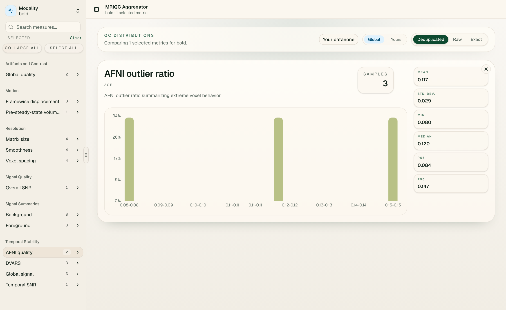

## Summary {.summary-slide .section-scale}

::: {.hero-grid}
::: {.hero-copy}
<div class="eyebrow">What we built</div>

<p class="lede"><strong>MRIQC DB Aggregator</strong> is a backend-plus-dashboard effort to make MRIQC DB easier to explore than the current page-oriented public API allows.</p>

<div class="tag-row">
  <span class="tag">resumable bulk ingest</span>
  <span class="tag">typed PostgreSQL warehouse</span>
  <span class="tag">dedupe-aware API</span>
  <span class="tag">live HTTPS dashboard</span>
</div>

<div class="callout">
  The core problem: the public MRIQC API is fine for record retrieval, but awkward for repeated analysis, filtering, upload comparison, and dashboard-style exploration.
</div>
:::

::: {.hero-panel}
<div class="panel-title">This weekend’s outcome</div>

- used representative API samples to settle the schema and read model
- bulk-loaded the larger direct dump into PostgreSQL with resumable ingestion
- deployed the compose stack publicly with Gunicorn, nginx, and TLS
- added a dashboard flow for comparing uploaded MRIQC CSVs against the reference archive

<div class="stat-grid">
  <div class="stat"><span class="value">4.03M</span><span class="label">loaded observations</span></div>
  <div class="stat"><span class="value">3</span><span class="label">initial modalities</span></div>
  <div class="stat"><span class="value">live</span><span class="label">public dashboard</span></div>
</div>
:::
:::

## Backend {.section-scale}

::: {.grid-2 .design-equal}
::: {.card}
<div class="panel-title">Backend work</div>

- migrated against the application-level API contract, not Mongo internals
- used pulled API payloads first, then added a direct dump ingestion path
- kept `t1w`, `t2w`, and `bold` as separate fact tables
- made the larger load resumable and safe to rerun without re-calling the API
- preserved unknown fields in JSON extras instead of over-normalizing early

<div class="pill-list">
  <span class="pill">reproducible ingestion</span>
  <span class="pill">bulk load + resume</span>
  <span class="pill">typed filters</span>
  <span class="pill">forward-compatible schema</span>
</div>
:::

::: {.card}
<div class="panel-title">Why this matters</div>

<div class="metric-list">
  <div class="metric"><span class="name">T1w rows now loaded</span><span class="number">2,306,000</span></div>
  <div class="metric"><span class="name">T2w rows now loaded</span><span class="number">235,813</span></div>
  <div class="metric"><span class="name">bold rows now loaded</span><span class="number">1,485,445</span></div>
  <div class="metric"><span class="name">Live stack now serves</span><span class="number">frontend + API + TLS</span></div>
</div>

<div class="callout">
  The sample run got the schema and API shape right; the direct dump path turned that into a usable reference dataset.
</div>
:::
:::

## Dashboard Design I

::: {.grid-2 .design-wide}
::: {.card}
<div class="panel-title">Design goals</div>

- start with overview plus drilldown
- keep dedupe mode visible: `raw`, `exact`, `series`
- make filtering simple and stable
- support a clear researcher question: “how does my study compare to the broader MRIQC reference set?”

<div class="tag-row">
  <span class="tag">overview cards</span>
  <span class="tag">metric explorer</span>
  <span class="tag">duplicate inspection</span>
  <span class="tag">upload overlay</span>
</div>
:::

::: {.card}
<div class="panel-title">Design principle</div>

<div class="quote-block">
  Don’t make users think in API pages and raw documents. Let them think in modalities, filters, metrics, and “where does my upload sit?”
</div>

<div class="timeline">
  <div class="timeline-item"><div class="phase">Overview</div><div class="body">How much reference data is here, and what changes with dedupe mode?</div></div>
  <div class="timeline-item"><div class="phase">Compare</div><div class="body">What happens when I overlay a small uploaded MRIQC CSV on the same metric distribution?</div></div>
  <div class="timeline-item"><div class="phase">Inspect</div><div class="body">What duplicate or metadata quirks should I understand before using the archive as a benchmark?</div></div>
</div>
:::
:::

## Dashboard Design II

::: {.grid-2}
::: {.card}
<div class="panel-title">Current dashboard snapshot</div>

```{=html}
<div class="mini-browser dashboard-shot">
  <div class="toolbar">
    <span class="dot"></span><span class="dot"></span><span class="dot"></span>
    <code>/?modality=bold&amp;view=series</code>
  </div>
  
</div>
```
:::

::: {.card}
<div class="panel-title">Features we are designing toward</div>

- uploaded-study versus reference comparisons
- saved views and shareable URLs
- recurring refresh instead of one-off backfills
- smarter serving layers for hot queries

<div class="callout">
  The UI is no longer just a wireframe problem. The main question now is which comparison workflows deserve to be first-class.
</div>
:::
:::

## Frontend Tech Stack

<div class="stack-grid">
  <div class="stack-card"><span class="stack-label">UI</span><h3>React + TypeScript</h3><p>The dashboard now supports metric search, dedupe-aware view switching, and an uploaded-CSV comparison overlay.</p></div>
  <div class="stack-card"><span class="stack-label">API</span><h3>FastAPI + Gunicorn</h3><p>The frontend reads from overview, metric summary, histogram, duplicate, and metadata endpoints exposed by the backend.</p></div>
  <div class="stack-card"><span class="stack-label">Storage</span><h3>PostgreSQL</h3><p>The reference data now sits in typed, indexed tables instead of only behind page-oriented MRIQC API reads.</p></div>
  <div class="stack-card"><span class="stack-label">Deploy</span><h3>Nginx + Compose</h3><p>The production stack serves the built dashboard at <code>/</code>, proxies <code>/api/</code>, and terminates HTTPS for the live demo site.</p></div>
</div>

<div class="callout">
  The integration story is now end to end: React dashboard, FastAPI read layer, PostgreSQL reference data, and a live HTTPS deployment.
</div>

## Demo

::: {.grid-2}
::: {.card}
<div class="panel-title">Demo flow</div>

<div class="demo-steps">
  <div class="demo-step"><div class="step-number">1</div><div><strong>Start on the live site.</strong> Show the overview cards and current modality counts.</div></div>
  <div class="demo-step"><div class="step-number">2</div><div><strong>Toggle dedupe mode.</strong> Contrast `raw`, `exact`, and `series`.</div></div>
  <div class="demo-step"><div class="step-number">3</div><div><strong>Upload a tiny MRIQC CSV.</strong> Show the “yours versus global” overlay on one metric.</div></div>
  <div class="demo-step"><div class="step-number">4</div><div><strong>Inspect duplicates.</strong> Explain why this still matters before using the archive as a benchmark set.</div></div>
</div>
:::

::: {.card}
<div class="panel-title">Current status</div>

```text
GET /api/v1/overview
GET /api/v1/modalities/{modality}/profile
GET /api/v1/modalities/{modality}/metrics
GET /api/v1/modalities/{modality}/metrics/{field_name}
GET /api/v1/modalities/{modality}/duplicates/{kind}
```

- live deployment: https://mriqcdb-aggregator.site
- frontend dashboard is real now and supports uploaded-versus-reference comparison
- backend, frontend, and TLS termination are all part of the production compose story
:::
:::

## Future Directions

::: {.closing}
::: {.hero-copy}
<div class="eyebrow">What comes next</div>

<p class="lede"><strong>Next phase:</strong> turn the one-off backfill and demo deployment into a repeatable researcher workflow.</p>

<div class="roadmap">
  <div class="roadmap-item"><h3>Refresh</h3><p>Set up a recurring ingest path instead of treating population as a one-time event.</p></div>
  <div class="roadmap-item"><h3>Serving</h3><p>Add materialized views or pre-aggregates once the hot queries are obvious.</p></div>
  <div class="roadmap-item"><h3>Comparisons</h3><p>Make upload-versus-reference workflows clearer and more deliberate.</p></div>
  <div class="roadmap-item"><h3>Data model</h3><p>Normalize carefully around studies, sessions, and scanners only where it clearly helps.</p></div>
</div>
:::

::: {.hero-panel}
<div class="panel-title">Takeaway</div>

- we moved from a sampled prototype to a live reference service
- we made the ingest and deploy paths reproducible
- we made dedupe and upload comparison visible in the UI
- we have a clear next step: operationalize refresh and tighten analyst workflows
:::
:::
